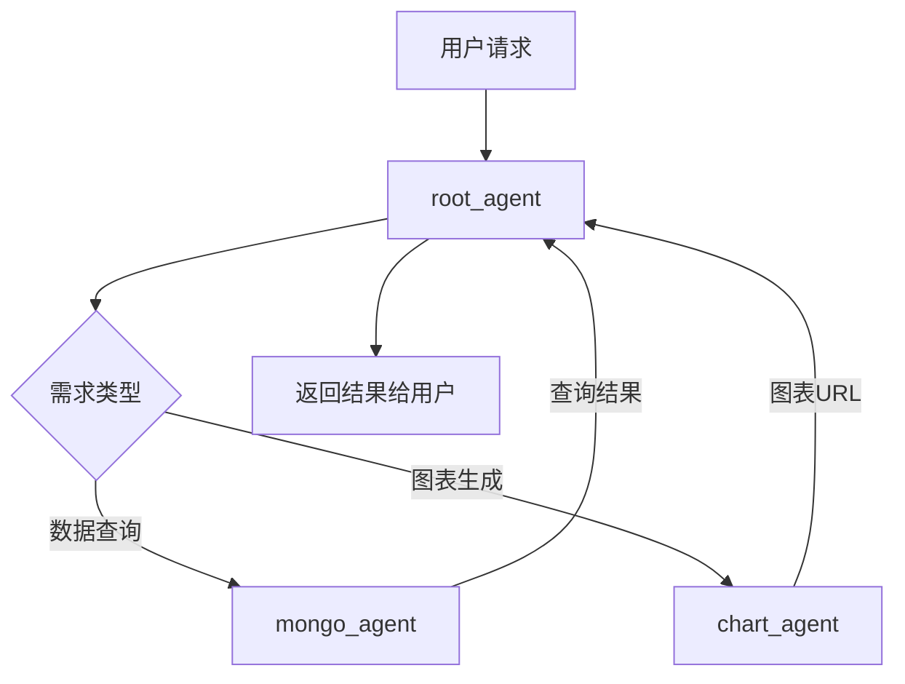

# PydanticAI 多代理系统示例

## 项目概述

这是一个基于[PydanticAI](https://ai.pydantic.dev/)构建的多代理系统示例项目，展示了如何使用多个专业代理协同工作。

## 功能特性

- 多代理协作架构
  - MongoDB 数据代理 (`agents/mongo_agent.py`)
  - 图表生成代理 (`agents/chart_agent.py`)
  - 根协调代理 (`agents/root_agent.py`)
- LLM 工具集成 (`utils/llm.py`)
- 流式输出处理 (`utils/stream_output.py`)

### 代理协作流程



## 安装指南

1. 确保已安装[uv](https://docs.astral.sh/uv/)和[ruff](https://docs.astral.sh/ruff/)
2. 克隆本仓库
3. 使用 uv 同步依赖

```bash
uv sync
```

## 使用说明

1. 配置环境变量 (复制`.env.example`为`.env`并填写)
2. 运行主程序：

   ```bash
   uv run ./main.py
   ```

## 项目结构

```
.
├── .env                # 环境配置文件
├── main.py             # 主程序入口
├── pyproject.toml      # 项目配置
├── agents/             # 代理模块
│   ├── root_agent.py   # 根协调代理
│   ├── mongo_agent.py  # MongoDB代理
│   └── chart_agent.py   # 图表生成代理
└── utils/              # 工具模块
    ├── llm.py          # LLM工具
    ├── deps.py         # 依赖管理
    └── stream_output.py # 流式输出处理
```

## 贡献指南

欢迎提交 Pull Request。请确保：

1. 使用 Ruff 格式化代码：
   ```bash
   ruff format .
   ```
2. 通过 Ruff 检查：
   ```bash
   ruff check .
   ```
3. 代码符合 PEP8 规范
4. 添加适当的单元测试
5. 更新相关文档

## 许可证

MIT License
